# Architecture

## 1. Goals

ToolLayer AI exists to answer one question: **how does an AI application call a real API
safely?**

The design goals follow from taking that question seriously:

| Goal | What it rules out |
|---|---|
| A model's output is never trusted | Prompt-level guardrails as the primary control |
| What a tool *is* is decided before runtime, by a human | Generating tools on the fly from a live specification |
| An artifact a runtime serves is verifiable *and* attributable | "The control plane told us so" as the integrity story |
| The two halves can evolve independently | A shared database, a shared object model, or a shared process |
| Provider neutrality is testable | A single adapter, or a canonical format that is one provider's format renamed |
| Refusing beats approximating | Best-effort conversion of features the executor cannot honor |

The non-goals matter as much. This is not a chatbot, not an agent framework, and not a
production platform. The runtime exists to prove the control plane's output is usable.

## 2. System overview

```mermaid
flowchart LR
    Admin(["Administrator"])
    Client(["AI application"])

    subgraph CP["Tool Control Plane"]
        direction TB
        Ingest["Source ingestion"]
        Analyze["Analysis and conversion"]
        Review["Human review"]
        Publish["Publication"]
        Deploy["Deployment snapshots"]
        Read["Internal read API"]
        DB[("Control-plane database")]
        Ingest --> Analyze --> Review --> Publish --> Deploy --> Read
        Publish <--> DB
        Deploy <--> DB
    end

    subgraph RT["LLM Orchestration Runtime"]
        direction TB
        Load["Snapshot load and verify"]
        Discover["Tool discovery"]
        Select["Tool selection"]
        Validate["Argument validation"]
        Policy["Policy evaluation"]
        Execute["Governed execution"]
        Load --> Discover --> Select --> Validate --> Policy --> Execute
    end

    API["Upstream HTTP API"]
    Provider["Model provider<br/>(deterministic by default)"]

    Admin -->|"OpenAPI document"| Ingest
    Client -->|"natural language + roles"| Discover
    Read -->|"immutable snapshot, ETag"| Load
    Select <--> Provider
    Execute -->|"allowlisted, bounded"| API

    DB -. "no shared database" .- Load
```



Two services. One direction of dependency: the runtime reads from the control plane and the
control plane knows nothing about any runtime. There is no callback, no push, and no shared
storage.

## 3. Components

| Component | Responsibility | Deliberately not responsible for |
|---|---|---|
| `packages/contracts` | The normative schemas, typed models, canonical serialization, error shape, provider adapters | Any business rule |
| `packages/openapi-converter` | Loading, resolving, analyzing, and converting API descriptions | Persistence, network, review decisions |
| `packages/policy-engine` | Authorization, destination policy, argument validation, governed execution | Deciding *which* tool to call |
| `packages/mock-llm` | Deterministic tool selection, argument generation, response formatting | Anything security-relevant |
| `apps/control-plane` | Ingestion, review lifecycle, publication, deployments, the admin and internal APIs | Executing tools |
| `apps/runtime` | Snapshot loading, discovery, orchestration, execution | Authoring anything |
| `apps/demo-api` | A synthetic upstream to call | Being interesting |

The two shared packages that carry rules — the converter and the policy engine — are
imported by *both* services. That is intentional: the control plane can show a reviewer
exactly the policy their tool will be subject to, because it evaluates the same code the
runtime will.

## 4. Responsibility boundaries

**The Control Plane owns configuration time.** It decides what a tool *is*: which operations
become tools, what arguments they accept, where they point, what effect they may have, and
who may call them. It never processes a user request and never calls an upstream API.

**The Runtime owns request time.** It decides whether *this* call, by *this* caller, right
now, may proceed. It never authors, edits, or publishes anything.

The split matters because the two have different threat models. Configuration time is slow,
human-supervised, and auditable. Request time is fast, driven by model output, and adversarial.
Mixing them would mean applying one set of assumptions to both.

## 5. Communication

The services communicate through exactly one interface:

```
GET /internal/v1/deployments/{deployment_key}/snapshot
     header: x-toollayer-service-token
     header: if-none-match (optional)
  → 200 + DeploymentSnapshot + ETag
  → 304 (unchanged)
  → 503 (no snapshot to serve)
```

Four properties make this enough:

- **Versioned in the path.** A breaking change ships as `/internal/v2/`.
- **Read-only.** The runtime cannot change control-plane state, so a compromised runtime
  cannot publish a tool.
- **Self-contained.** One response carries every connector definition the deployment may
  serve. No follow-up requests, no partial state.
- **Content-addressed and signed.** The document embeds a digest of its own canonical
  bytes, which the consumer recomputes, and a producer signature the consumer verifies against
  a public key it was configured with out of band. The digest answers *are these the same
  bytes*; only the signature answers *did we produce them*.

Neither service imports the other's modules. `tests/contract` fails if the schemas and the
models drift, which is the failure mode that would otherwise go unnoticed until production.

## 6. Consistency model

The system is **eventually consistent, with bounded and observable staleness**.

The runtime holds an immutable snapshot and refreshes it on an interval (default 60 seconds,
configurable). Between refreshes it serves the snapshot it holds. Publishing a new version
does not affect a running runtime until it next refreshes — which is a *feature*: a runtime
mid-request cannot have its tools change underneath it.

Consequences, stated plainly:

- A newly published version takes up to one refresh interval to become servable.
- A disabled version stays servable until the next refresh. Disablement is not revocation;
  `docs/threat-model.md` records that as an accepted limitation.
- If the control plane is unreachable, the runtime keeps serving its verified snapshot rather
  than failing. Availability is preferred over freshness here because the held artifact was
  verified when it was loaded and cannot have changed since.

## 7. Versioning

Three independent version axes, deliberately not collapsed into one:

| Axis | Format | Changes when |
|---|---|---|
| Contract version | SemVer, in every document | The shared schemas change |
| Connector version | SemVer, per connector | A new set of tools is published |
| Snapshot revision | Monotonic integer, per deployment | A deployment's pinned versions change |

A connector version is immutable once published, and must strictly increase. A snapshot
revision is never reused. The contract version is checked on load: a different major line is
refused, and a newer minor than the consumer understands is refused rather than
half-interpreted.

## 8. Snapshot lifecycle

```
draft ──review──> draft' ──publish──> PublishedVersion (immutable)
                                            │
                                            ├─ selected into ──> DeploymentSnapshot rev N (immutable)
                                            │                              │
                                            └─ disable ─────> unavailable  └──> runtime loads, verifies, serves
                                                              for new snapshots
```

- A **draft** is mutable, carries a revision, and is edited under optimistic concurrency.
- **Publication** is server-authoritative: the artifact is rebuilt from stored analysis and
  stored review decisions, never from the request body. The draft is then consumed.
- A **published version** is written once. Only `disabled_at` may change afterwards, which is
  why the digest still verifies after disablement.
- A **snapshot** pins exactly one version per connector and is never edited. A change creates
  revision N+1 and deactivates N; N stays queryable and byte-identical.

## 9. Failure boundaries

| Failure | Contained by | Observable as |
|---|---|---|
| One operation cannot be converted | Per-operation diagnostics | The other operations still convert |
| One tool cannot be projected for a provider | Per-tool adapter diagnostics | The other tools still project |
| A draft is edited concurrently | Optimistic revision check | `revision_conflict`, reload and retry |
| The control plane is unreachable | The runtime keeps its verified snapshot | A warning log; requests still served |
| A snapshot fails its digest check | Load refuses; the previous snapshot stays in service | `snapshot_integrity_failed` |
| A snapshot's producer cannot be authenticated | Load refuses; the previous snapshot stays in service | `snapshot_signature_invalid` |
| An upstream API is slow or huge | Finite timeouts and a byte cap enforced while streaming | `upstream_timeout` / `response_too_large` |
| An upstream redirects | Redirects are never followed | `redirect_not_allowed` |

Nothing here degrades into "serve whatever arrived". Every failure either isolates to one
item or falls back to the last verified state.

## 10. Security boundaries

Four boundaries, each with an independent control:

1. **Ingestion.** Untrusted documents are bounded, parsed strictly, and never dereferenced
   over the network. There is no HTTP client in the converter package at all.
2. **Publication.** The server rebuilds the artifact from its own state. A client cannot
   publish a definition no reviewer approved.
3. **Authorization.** One function, called by both discovery and execution, so the visible
   set and the executable set cannot diverge.
4. **Execution.** Default-deny destination allowlist, method allowlist, schema-validated
   arguments, post-resolution address checks, no redirects, finite timeouts, bounded responses.

`docs/threat-model.md` states what these do and do not defend against.

## 11. Trade-offs

**SQLite by default.** The demo runs with no external service, at the cost of concurrent
write throughput. PostgreSQL works by changing one connection string; nothing in the model
depends on SQLite.

**Whole artifacts stored as JSON.** A published version is stored as one document rather than
normalized rows. Querying across tools is therefore awkward — but the artifact stays
byte-reproducible, which is what makes the digest meaningful. Reassembling it from tables
would make the digest depend on the ORM's serialization of the day.

**Polling instead of push.** The runtime polls with a conditional request rather than being
notified. Push would be fresher and would also give the control plane a reason to know about
every runtime, which is the coupling this design is built to avoid.

**Refusing unsupported OpenAPI features.** The converter handles a deliberate subset. A more
permissive converter would cover more real-world documents and would produce tools whose
behavior does not match their description. The refusal is visible; the mismatch would not be.

**A deterministic default provider.** The demo cannot show off a real model's reasoning. In
exchange, every security claim is a repeatable assertion rather than one sample of a
distribution.

**Static bearer tokens between the services.** Not an identity system. Sufficient to demonstrate
that two audiences have two different credentials, and honestly labelled as a simplification.
Snapshot signing keys are a different matter and do rotate, through a trusted key ring.

## 12. Limitations

- Single-tenant. There is one organization scope.
- Disablement is not immediate revocation; a running runtime honors it at its next refresh.
- No credential management. Connectors carry an opaque `auth_profile_ref` and no secret; the
  runtime does not resolve it.
- One turn per request. No conversation memory, no multi-step planning, no tool chaining.
- The converter supports one JSON request body per operation and no header or cookie arguments.
- The runtime executes at most one tool per request. That is a deliberate constraint of the
  reference implementation, not a claim that multi-step orchestration is unnecessary.
