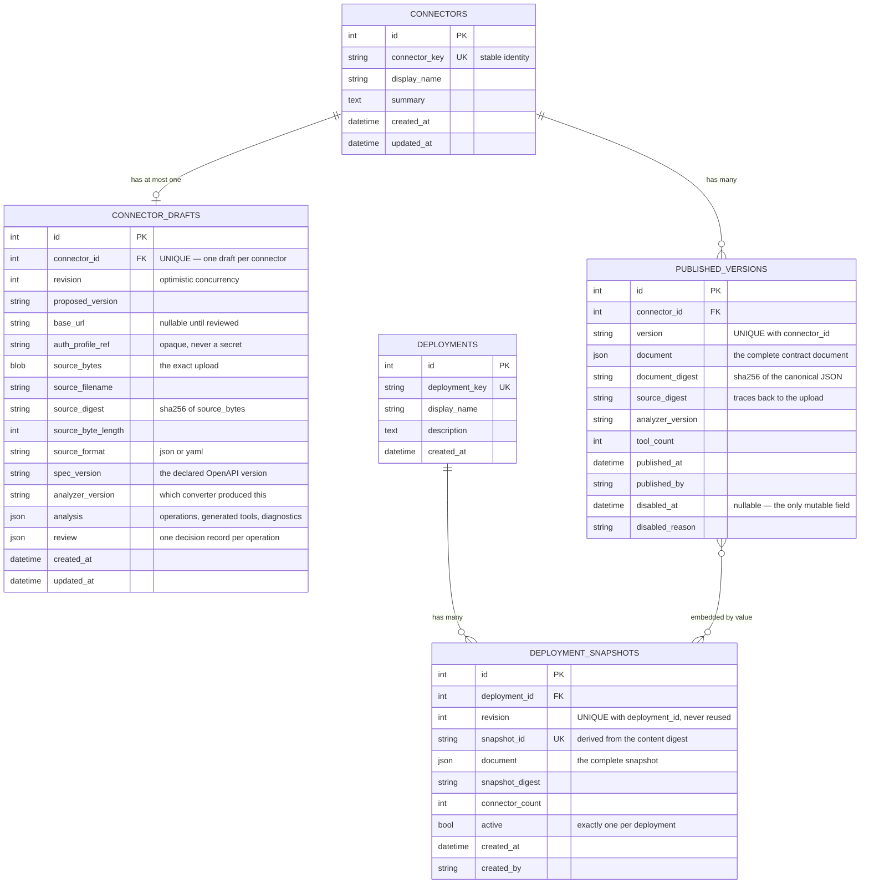
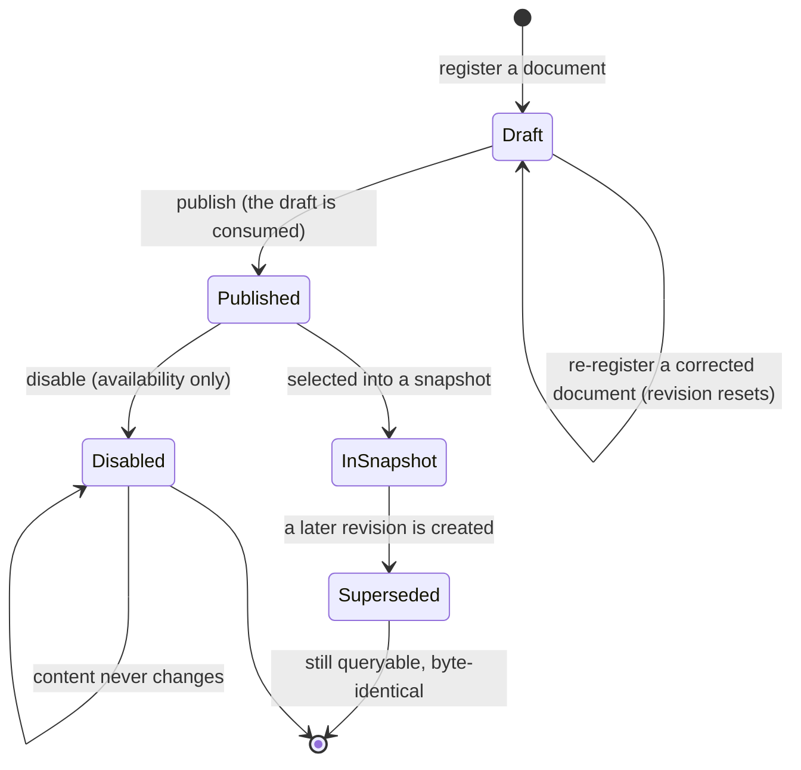

# Data model

The Control Plane owns the only database in the system. The Runtime is stateless: it holds a
verified snapshot in memory and persists nothing.

## 1. The organizing distinction

Every table is on one side of a single line: **may this row change after it is written?**

| | Mutable | Immutable |
|---|---|---|
| Tables | `connectors`, `connector_drafts` | `published_versions`, `deployment_snapshots` |
| Concurrency | Optimistic, via `revision` | Insert-only; uniqueness enforced by constraint |
| Contains | Authoring workspace state | A complete contract document plus its digest |
| Changing it means | An `UPDATE` | Writing a new row |

The immutable rows store a whole JSON document rather than normalized columns. That is a
deliberate trade: querying across tools is awkward, but the artifact stays byte-reproducible,
which is what makes its digest meaningful. Reassembling it from a dozen tables would make the
digest depend on the ORM's serialization of the day.

Every rule that protects immutability is a **database constraint**, not an application check —
an application check does not survive two concurrent requests.

## 2. Entity relationships

The relationship between `PUBLISHED_VERSIONS` and `DEPLOYMENT_SNAPSHOTS` is drawn as
many-to-many, but it is **embedded by value**, not by foreign key. A snapshot contains a copy
of each connector document. That is what makes the snapshot self-contained and
digest-verifiable — a reference would mean the runtime had to trust that the referenced row
had not changed, which is exactly the property a snapshot is supposed to remove.

## 3. Lifecycle states

Notes on transitions that are easy to get wrong:

- **Publishing consumes the draft.** Leaving it would mean an editable copy of something
  already published, and the next edit would look like it was changing the published version.
- **Disabling changes availability, not bytes.** The digest still verifies afterwards. A
  disabled version cannot enter a *new* snapshot; a snapshot that already pins it keeps working
  until it is rebuilt.
- **A superseded snapshot is not deleted.** Revision 1 stays queryable and byte-identical after
  revision 2 exists, so "the runtime was on revision 1" remains an answerable question.

## 4. Ownership

| Entity | Written by | Read by |
|---|---|---|
| `connectors`, `connector_drafts` | Control Plane, on administrator action | Control Plane, console |
| `published_versions` | Control Plane, on publish | Control Plane, console; embedded into snapshots |
| `deployments`, `deployment_snapshots` | Control Plane, on administrator action | Control Plane, console; served to the Runtime |

The Runtime has **no database access at all**. It reads one HTTP endpoint. If it had a
connection string, "the two services own independent state" would be a comment rather than a
property.

## 5. What is deliberately absent

| Not stored | Why |
|---|---|
| Credentials, tokens, API keys | Connectors carry an opaque `auth_profile_ref` and nothing else. There is no column that could hold a secret. |
| End-user identity or conversation history | The Runtime is stateless and the Control Plane never sees a user. |
| Execution logs or tool-call results | Out of scope; upstream responses are untrusted and are not persisted. |
| Tenant or organization identifiers | Single-tenant by design. Multi-tenancy would be a schema change, not a filter. |

## 6. Migrations

Alembic, with the initial revision generated from the models. `create_schema()` exists for
tests and first local runs, where the database starts empty every time; Alembic owns any
schema that persists.

Two conventions:

- **Migrations are additive within a release.** Dropping a column that an immutable row's
  document depends on would break digest verification for artifacts already published.
- **The stored documents are versioned by `contract_version`, not by the schema.** A contract
  change is a contract-version bump and, if needed, a read-time migration — not an `UPDATE`
  over rows that other systems have already verified by digest.

## 7. Indexes and constraints

| Constraint | Protects |
|---|---|
| `connectors.connector_key` unique | One connector per key |
| `connector_drafts.connector_id` unique | Exactly one draft per connector |
| `(published_versions.connector_id, version)` unique | Version immutability under concurrency |
| `(deployment_snapshots.deployment_id, revision)` unique | Revisions are never reused |
| `deployment_snapshots.snapshot_id` unique | A content-derived identifier stays unique |
| `deployments.deployment_key` unique | One deployment per key |
| Index on `published_versions.connector_id` | Listing a connector's versions |

Foreign keys cascade on delete, and SQLite has `PRAGMA foreign_keys=ON` set on every
connection — it is off by default there, which would silently disable every cascade rule the
model relies on.
