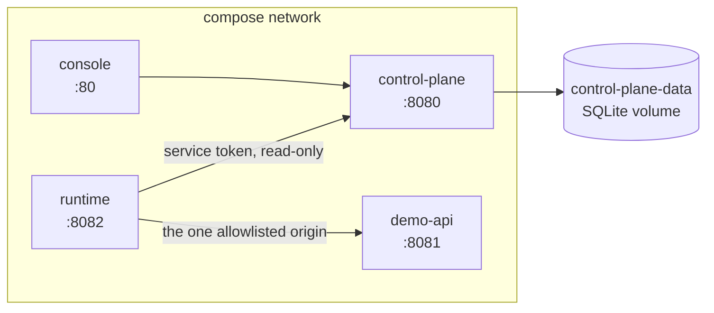

# Deployment

This describes how to run ToolLayer AI **locally**. It is not a production deployment guide,
and section 8 says why.

## 1. Requirements

| | Version | Needed for |
|---|---|---|
| Python | 3.11 or 3.12 | The three services |
| Node.js | 20+ | The console (optional) |
| Docker | any recent | `make demo-docker` (optional) |

No API key. No network egress. No external database.

## 2. Local development

```bash
make setup     # create .venv and install everything
make demo      # start all three services, run the demonstration, shut down
```

`make demo` prints each stage — register, review, publish, deploy, load, ask, reject — and
exits non-zero if any control fails to reject. It is a demonstration and a smoke test.

To run the services individually, in three terminals:

```bash
make run-demo-api        # :8081
make run-control-plane   # :8080
make run-runtime         # :8082
```

And the console:

```bash
cd apps/control-plane/frontend && npm install && npm run dev   # :5173
```

## 3. Docker Compose

```bash
docker compose up -d --build
make demo-docker
docker compose down -v
```

Topology:



The three Python services share one image and differ only in their start command. Building one
image keeps them provably on the same code and the same contract version — which is exactly
the drift the contract tests exist to catch.

The runtime's `TOOLLAYER_ALLOWED_ORIGINS` names `http://demo-api:8081` explicitly. There is no
wildcard: adding a fourth service to the compose file does not make it reachable from a tool
call.

## 4. Ports

| Service | Port | Purpose |
|---|---|---|
| Control Plane | 8080 | Admin API, internal snapshot API |
| Demo API | 8081 | The synthetic upstream |
| Runtime | 8082 | Tool discovery and orchestration |
| Console | 5173 (dev) / 80 (container) | The review UI |

Override with `CONTROL_PLANE_PORT`, `DEMO_API_PORT`, `RUNTIME_PORT`.

## 5. Health and readiness

Both services distinguish the two, because they answer different questions.

| Endpoint | Question | Fails when |
|---|---|---|
| `/healthz` | Is the process alive? | The process is down. Deliberately does not touch the database, so a database outage does not trigger a restart loop. |
| `/readyz` | Can it serve requests? | Control Plane: the database does not answer. Runtime: no verified snapshot is loaded. |

The runtime's `/readyz` returning 503 with `no deployment snapshot` is the correct answer
before a snapshot exists — reporting ready and then failing every call would be worse.

`/healthz` on the runtime also reports `destination_policy_relaxed`, so a runtime running with
an escape hatch enabled identifies itself rather than looking identical to a locked-down one.

## 6. Configuration

Every setting is an environment variable, read once at startup and validated. See
`.env.example` for the annotated list. The ones that matter:

| Variable | Default | Notes |
|---|---|---|
| `TOOLLAYER_CONTROL_PLANE_DATABASE_URL` | SQLite file | PostgreSQL by connection string |
| `TOOLLAYER_ADMIN_TOKEN` | dev placeholder | Must differ from the service token |
| `TOOLLAYER_SERVICE_TOKEN` | dev placeholder | Read-only access to snapshots |
| `TOOLLAYER_ALLOWED_ORIGINS` | **empty** | Empty permits nothing. No wildcard. |
| `TOOLLAYER_ALLOW_PLAINTEXT_HTTP` | `false` | Local development only |
| `TOOLLAYER_ALLOW_LOOPBACK_DESTINATIONS` | `false` | Local development only |
| `TOOLLAYER_ALLOW_PRIVATE_ADDRESSES` | `false` | Local development only |
| `TOOLLAYER_SNAPSHOT_REFRESH_SECONDS` | `60` | Bounds how stale a snapshot may be |
| `TOOLLAYER_MAX_RESPONSE_BYTES` | `1048576` | Hard-capped at 16 MiB |

The Control Plane refuses to start if the two tokens are equal, and logs a warning if either is
still the shipped placeholder.

## 7. Persistence

SQLite by default, in a Docker volume or a local `data/` directory. PostgreSQL works by
changing the connection string and installing the `postgres` extra; nothing in the model
depends on SQLite.

Two SQLite pragmas are set on every connection: `foreign_keys=ON` (off by default there, which
would silently disable every cascade the model relies on) and `journal_mode=WAL`.

Schema comes from Alembic. `create_schema()` exists for tests and first local runs where the
database starts empty every time.

## 8. Startup order

The runtime depends on the control plane being reachable, but does not require it at startup —
it retries and reports `not ready` until a snapshot is available. In Compose, `depends_on` with
`condition: service_healthy` makes the ordering explicit anyway.

A cold start therefore looks like: services up → `/readyz` 503 on the runtime → an
administrator publishes and snapshots → the runtime's next refresh → `/readyz` 200.

## 9. Troubleshooting

| Symptom | Cause | Fix |
|---|---|---|
| `readyz` 503, `no deployment snapshot` | Nothing published yet | Run `make demo`, or publish and snapshot through the console |
| `destination_not_allowed` | The origin is not allowlisted | Add the exact `scheme://host:port` to `TOOLLAYER_ALLOWED_ORIGINS` |
| `private_address_blocked` | The destination resolves to a non-routable address | Local development: set `TOOLLAYER_ALLOW_LOOPBACK_DESTINATIONS=true`. Never in production. |
| `unauthenticated` on `/admin/v1/...` | Wrong or missing token | Check `TOOLLAYER_ADMIN_TOKEN` |
| Control Plane will not start | The two tokens are equal | Set different values |
| `revision_conflict` | The draft changed since it was read | Reload and reapply |
| `unsupported_spec_feature` | The document uses something the converter refuses | See the table in `docs/control-plane.md` §4 |
| CORS errors in the console | Origin not allowed | Add it to `TOOLLAYER_CONTROL_PLANE_CORS_ORIGINS` |

Service logs from `make demo` land in `.demo-logs/`.

## 10. Production limitations

**This topology is not production-ready, and the gaps are specific:**

- **Static bearer tokens.** No rotation, no expiry, no per-actor identity.
- **The console ships its token in the browser bundle.** It must sit behind an authenticating
  proxy anywhere real.
- **No TLS in the compose file.** Services speak plaintext HTTP on a private network. Real
  deployment needs TLS termination and `TOOLLAYER_ALLOW_PLAINTEXT_HTTP=false`.
- **SQLite by default.** Fine for one process; use PostgreSQL for concurrent writers.
- **No horizontal scaling story.** The runtime is stateless and would scale, but nothing here
  addresses snapshot distribution across many instances.
- **No metrics or tracing.** Structured logs with redaction, and nothing else.
- **No rate limiting, quotas, or backpressure.**
- **No secret management.** Secrets come from the environment. There is no vault integration
  and no encryption at rest.
- **Single-tenant.**

These are honest gaps in a portfolio project, not an oversight to be discovered later.
`docs/PORTFOLIO_STRATEGY.md` records which were deliberate scope decisions.
