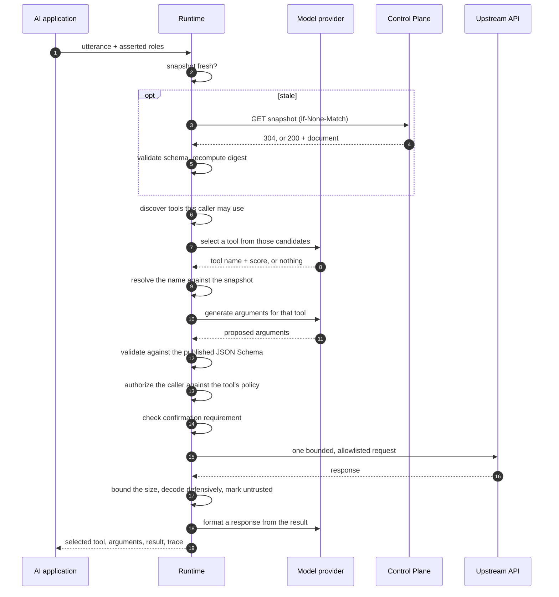

# LLM Orchestration Runtime

> The runtime is provided as a reference implementation rather than a full chatbot product.

Its job is to prove three things: that what the Control Plane publishes is actually usable,
that the service boundary works, and that the governance survives contact with model output.
It has no conversation memory, no streaming, and no product surface beyond a small CLI.

## 1. The sequence



Two orderings in that diagram carry weight.

**Authorization runs after selection and before execution.** Filtering the discovery list is a
usability measure. This is the step that decides whether the upstream API is reached, so it
holds against a fabricated call, a stale client-side tool list, and a policy that changed
since discovery.

**Formatting never feeds back into selection.** Step 15 summarizes and the turn ends. There is
no loop, so text inside a tool result cannot cause another tool call — which is the structural
reason the prompt-injection tests pass, rather than a filter that has to keep up with new
phrasings.

## 2. Snapshot acquisition

The runtime holds one immutable snapshot in memory and refreshes it on an interval.

**It is verified, not trusted.** Every fetch is validated against the contract schema and its
digest is recomputed over the canonical serialization. Transport integrity is not artifact
integrity: TLS proves who sent the bytes, not that the bytes are the artifact that was
published.

**It is replaced, never mutated.** A refresh builds a new object and swaps one reference. A
request that started on revision 4 finishes on revision 4, so a tool cannot change definition
halfway through the call executing it.

**Its freshness is checked, not assumed.** Refresh sends `If-None-Match`, so the common case
costs one small `304` and the runtime *learns* nothing changed rather than guessing.

**A refresh failure is not a serving failure.** If the control plane is unreachable, the held
snapshot stays in service with a warning. It was verified when it was loaded and is immutable,
so continuing to serve it is strictly better than refusing every request.

The runtime refuses to serve at all until it has one verified snapshot. `/readyz` reports that
state honestly rather than reporting ready and then failing every call.

## 3. Tool discovery

`GET /v1/tools` returns the tools the caller may use, with their input schemas.

Discovery calls the same `authorize_tool` function that execution calls. That is the entire
reason the function lives in the shared policy package: if discovery had its own copy, the two
would drift, and the drift always goes the same way — the filter gains a rule the execution
path does not.

## 4. Tool selection

Selection is delegated to a provider implementing three methods:

```python
select_tool(utterance, tools)      -> ToolSelection | None
generate_arguments(utterance, tool) -> ArgumentProposal
format_response(utterance, tool, content) -> str
```

The default is `MockLLMProvider`: deterministic, offline, rule-based. It is not a model and
does not pretend to be one. It exists so the security tests can be assertions instead of
samples — "an injected instruction does not cause a second tool call" is only worth asserting
if the component behaves identically every run.

Its scoring weights a term matching the tool's *name* above the same term appearing in prose,
counts argument names, and applies two asymmetries:

- An effect-bearing tool needs a matching verb, not merely the absence of a better candidate.
- A read-only tool is scored down when the request contains a mutation verb. Reading something
  adjacent is not a partial success when the caller asked for a change — it answers a question
  nobody asked and hides the fact that the change did not happen.

Below a score threshold the provider returns nothing and the runtime answers
`no_tool_selected`. A wrong tool call is worse than an admission that the request was not
understood.

**Whatever the provider returns is a proposal.** The name is resolved against the snapshot; a
name outside the candidate list is refused. The arguments are validated against the published
schema. A buggy or hostile provider cannot widen what executes.

## 5. Argument generation and validation

The provider proposes arguments using the tool's own schema as the guide, so it can never
invent an argument the tool did not declare. Anything it cannot find is reported as *missing*
rather than filled with a plausible default — a fabricated ticket identifier is worse than a
question.

Validation then runs against the published Draft 2020-12 schema. Because that schema is
closed, an undeclared argument is rejected rather than ignored. Every violation is reported,
not just the first, and no message contains the rejected value.

## 6. Policy evaluation

| Check | Effect |
|---|---|
| Method allowlist | The deployment's permitted HTTP methods |
| Role authorization | `public`, or the caller holds one of the allowed roles |
| Confirmation | A tool marked as requiring confirmation does not execute without it |
| Destination allowlist | Exact `scheme://host:port`, no wildcard, no suffix matching |
| Address family | Every resolved address checked; link-local always refused |

A denial names the outcome and not the rule that produced it. Telling a caller *which* role
would have worked turns every denial into a probe of the permission model. The reason code is
logged for operators.

## 7. Execution

The request is built by iterating the tool's published **bindings** and looking each one up —
never by iterating the supplied arguments. An argument the tool did not declare therefore has
nowhere to go, even if it somehow survived validation. The closed schema and the
binding-driven walk are two independent reasons the same attack fails.

Path values are percent-encoded with `safe=""`, so a value containing `/` or `?` becomes one
path segment rather than a different route.

The outbound call is bounded on every axis: connect timeout, read timeout, response bytes.
Redirects are disabled at the client rather than handled afterwards, so no code path can
forget; a 3xx is `redirect_not_allowed`. Environment proxies are ignored.

The response is size-capped and decoded defensively: JSON is parsed only when the upstream
declared JSON *and* the bytes actually parse. An upstream returning HTML with a JSON content
type does not get to decide it will be treated as structured data.

## 8. Untrusted results

Every result carries `untrusted: true` on the wire. Anything under `content` came from an
upstream API, is attacker-influenceable, and is data — never instructions.

The formatter summarizes results *structurally*: counts and named fields. It never inspects
result text for anything resembling an instruction, and there is no path from response content
back into tool selection. `tests/security` proves this with a seeded ticket whose body
contains text addressed to an assistant.

## 9. Provider abstraction

The canonical definition is the source of truth; a provider's tool format is an output
projection produced on demand and never persisted.

Two adapters ship, because one proves nothing — a single adapter could mean the canonical
format is that provider's format renamed. Two with genuinely different requirements force the
canonical layer to be the source of truth and surface where providers actually diverge.

The concrete divergence here is optionality. The Anthropic projection is ordinary JSON Schema
and needs no change. OpenAI strict function calling requires every declared property to be in
`required`, so optional properties are widened to accept `null` and the runtime reverses that
before validation. This is a **controlled normalization**, not a lossless projection: the
projected schema accepts one value the canonical schema does not, and it is safe only because
the canonical schema — never the projection — decides what executes. `tests/contract` asserts
the round trip.

Perfect cross-provider portability is not claimed.

## 10. Error handling

| Situation | Code | Status |
|---|---|---|
| No snapshot loaded | `snapshot_unavailable` | 503 |
| A snapshot failed its digest check | `snapshot_integrity_failed` | 502 |
| The tool is not in the snapshot | `unknown_tool` | 404 |
| Nothing matched the request | `no_tool_selected` | 422 |
| The arguments do not satisfy the schema | `argument_validation_failed` | 422 |
| The caller may not use this tool | `role_not_permitted` | 403 |
| Confirmation was required | `confirmation_required` | 409 |
| The destination is not allowlisted | `destination_not_allowed` | 403 |
| The destination resolves somewhere forbidden | `private_address_blocked` | 403 |
| The upstream redirected | `redirect_not_allowed` | 502 |
| The upstream response was too large | `response_too_large` | 502 |
| The upstream timed out | `upstream_timeout` | 504 |

Every response carries a request id, and every successful outcome carries a `trace` listing
the decisions in order — so the demo can show the reasoning rather than assert it.

## 11. API surface

| Method | Path | Purpose |
|---|---|---|
| `GET` | `/v1/tools` | The tools this caller may use |
| `POST` | `/v1/chat` | One full orchestration turn |
| `POST` | `/v1/tools/{name}/execute` | Execute one named tool directly |
| `POST` | `/v1/snapshot/refresh` | Force a refresh |
| `GET` | `/healthz` | Liveness, plus whether any destination escape hatch is enabled |
| `GET` | `/readyz` | Ready means a verified snapshot is loaded |

Caller identity arrives as `x-toollayer-caller` and `x-toollayer-roles`. **The runtime does not
authenticate anyone**; it enforces what the host application asserts. That trust boundary is
stated in `docs/threat-model.md` rather than hidden behind a header that looks authoritative.

`/healthz` reports `destination_policy_relaxed` so that a runtime running with loopback or
plaintext enabled says so about itself instead of looking identical to a locked-down one.
