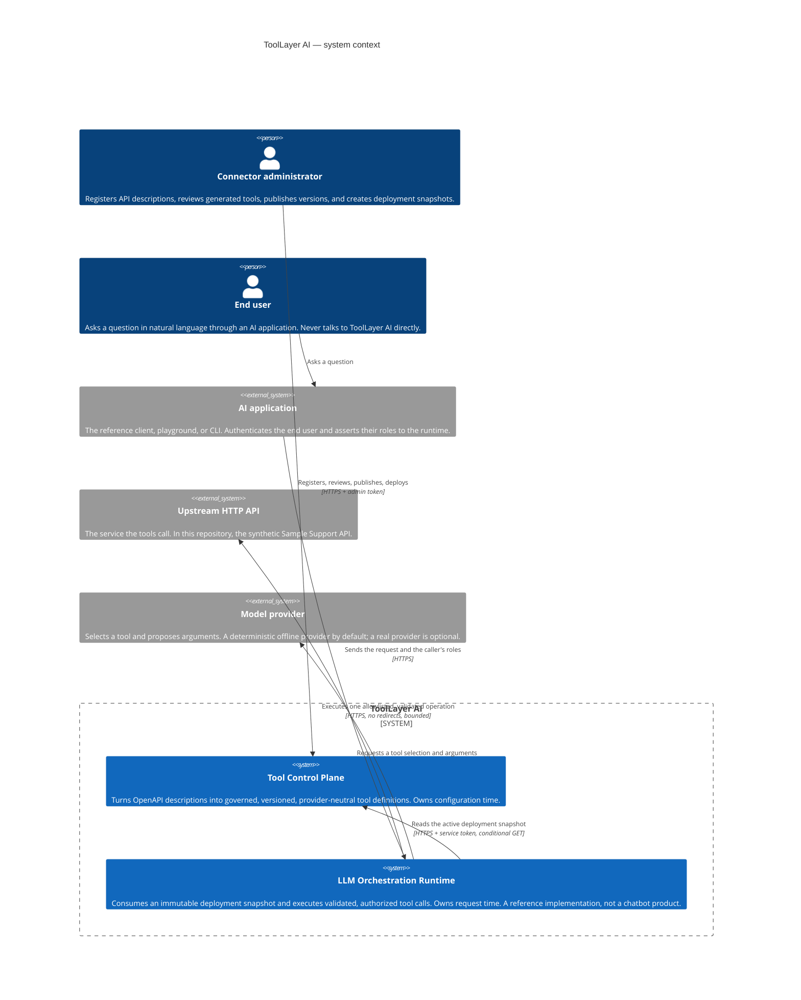
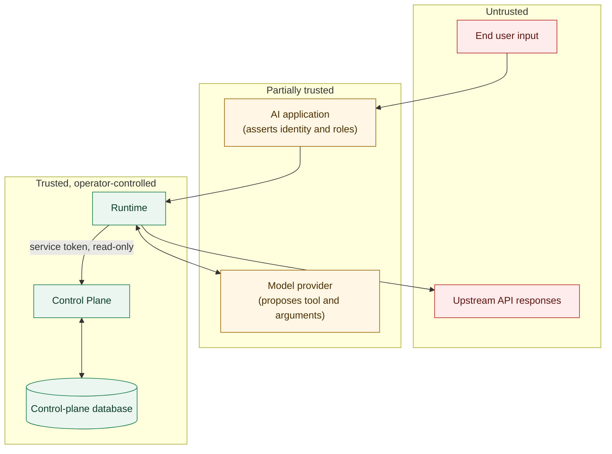

# System context

A C4-style context view: who and what interacts with ToolLayer AI, and across which
boundaries.

## Context diagram

## Actors

| Actor | Trust | What they can do |
|---|---|---|
| Connector administrator | Trusted | Everything at configuration time. Holds the admin token. |
| End user | Untrusted | Supplies natural-language text. Their input reaches tool selection and argument generation, and is validated at every step. |
| AI application | Partially trusted | Asserts the caller's identity and roles. ToolLayer AI does not authenticate users; it enforces what the client asserts. |
| Model provider | **Untrusted** | Proposes a tool and arguments. Every proposal is re-checked against the snapshot and the published schema. |
| Upstream API | **Untrusted** | Returns content that is treated as data and never as instructions. |

The two entries marked untrusted are the ones people usually get wrong. A model provider is a
component the system *asks for advice*, not one it obeys, and an upstream API is a source of
attacker-influenceable text.

## Boundaries

Each arrow crossing into the trusted zone has a named control:

| Crossing | Control |
|---|---|
| End-user text → runtime | Length bounds; the text only ever reaches the provider, never the request builder |
| Model proposal → execution | Tool name resolved against the snapshot; arguments validated against the published schema |
| Client role assertion → authorization | Roles are enforced as asserted; the runtime does not authenticate |
| Runtime → control plane | Service token, read-only endpoint, versioned path |
| Runtime → upstream API | Origin allowlist, method allowlist, post-resolution address check, no redirects, bounds |
| Upstream response → runtime | Size cap, defensive decoding, marked `untrusted`, never re-enters selection |

## What is out of scope

- User authentication and session management. The AI application does that.
- Credential storage and OAuth flows. Connectors carry no secrets; see `docs/feature-parity.md`.
- Rate limiting, quotas, and billing.
- Multi-tenancy. One organization scope.
- Model hosting. The provider is an interface, not a component this project runs.
